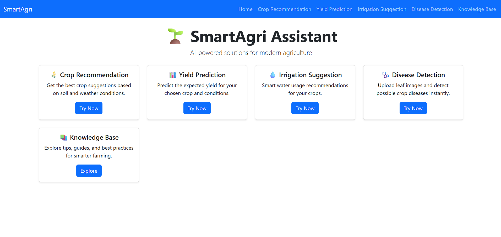
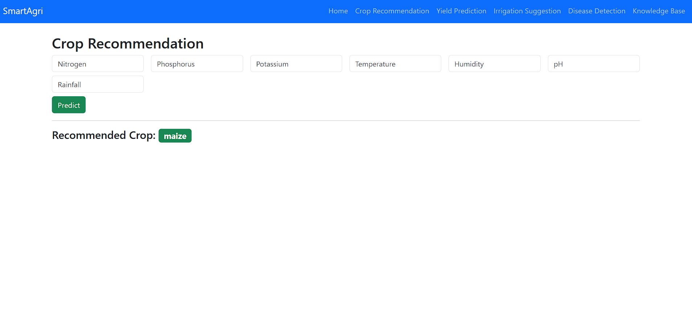
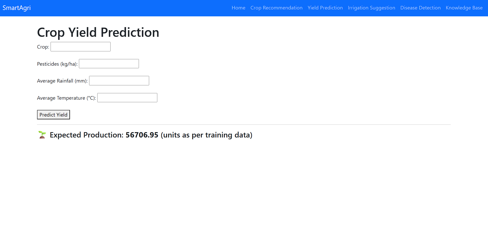
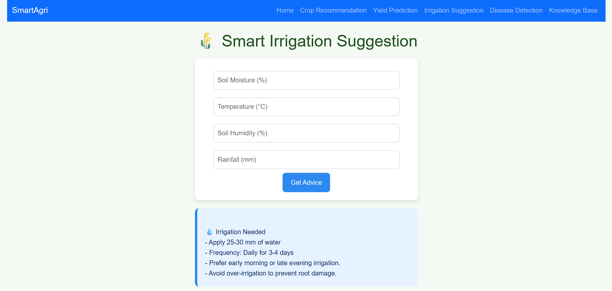
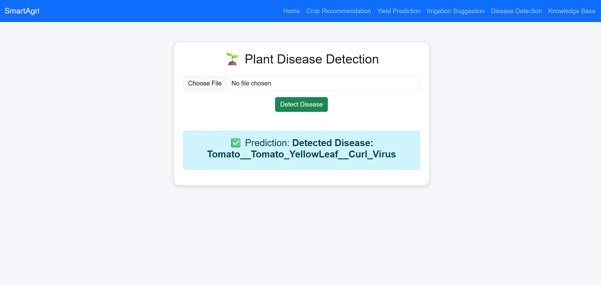
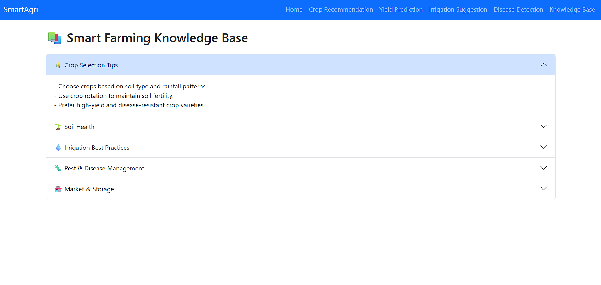

# 🌱 SmartAgri Assistant  
### AI-Based Agricultural Decision Support System  

SmartAgri Assistant is an AI-powered web application designed to help farmers make smarter decisions using Machine Learning and Deep Learning.  
It integrates multiple agricultural modules into a single platform to improve productivity, reduce risks, and promote sustainable farming.

---

## 🚀 Features

🌾 **Crop Recommendation**  
- Suggests the best crop based on soil nutrients and environmental conditions.

📈 **Yield Prediction**  
- Predicts expected crop yield using environmental and agricultural data.

💧 **Irrigation Suggestion**  
- Recommends whether irrigation is required based on soil moisture and weather conditions.

🌿 **Disease Detection**  
- Detects plant diseases using CNN-based image classification.

📚 **Knowledge Base**  
- Provides disease prevention tips and treatment suggestions.

---

## 🖥️ Application Screenshots

### 🏠 Home Page

### 🌾 Crop Recommendation

### 📈 Yield Prediction

### 💧 Irrigation Suggestion

### 🌿 Disease Detection

### 📚 Knowledge Base

---

## 🧠 Technologies Used

- Frontend: HTML, CSS, Bootstrap  
- Backend: Flask (Python)  
- Machine Learning: Scikit-learn (Random Forest)  
- Deep Learning: TensorFlow / Keras (CNN)  
- Database: SQLite (SQLAlchemy ORM)  

---

## 🏗️ System Architecture

- User Interface (Web Application)  
- Flask Backend (Routing & Logic)  
- Machine Learning Models  
- Database (SQLite)  
- Dataset & Input Layer  

---

## ⚙️ Installation & Setup

### 1️⃣ Clone the Repository

git clone https://github.com/Rushikesh293/SmartAgri-Assistant.git
cd SmartAgri-Assistant

### 2️⃣ Create Virtual Environment

python -m venv venv
venv\Scripts\activate

### 3️⃣ Install Dependencies

pip install -r requirements.txt

### 4️⃣ Train Models (Important ⚠️)
Model files are not included due to GitHub size limits.

python train/train_crop.py
python train/train_yield.py
python train/train_irrigation.py

### 5️⃣ Run the Application

python app.py

---

## 📌 Usage

- Open browser → http://127.0.0.1:5000/  
- Use the following modules:
  - Crop Recommendation  
  - Yield Prediction  
  - Irrigation Suggestion  
  - Disease Detection  

---

## ⚠️ Important Notes

- Model files (.pkl, .h5) are excluded due to GitHub size limits  
- Train models before running the application  
- Place datasets inside the /datasets folder  
- Ensure required Python libraries are installed  

---

## 🔮 Future Scope

- IoT sensor integration  
- Real-time weather API  
- Mobile application  
- Multi-language support  
- Cloud deployment  

---

## 👨‍💻 Author

Rushikesh Gughane  
B.Tech AI&DS   

---

## ⭐ Support

If you like this project, please ⭐ star the repository!